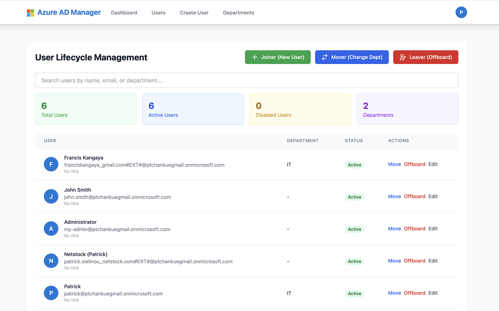

# Code setup

`python3 -m venv .venv`

`source .venv/bin/activate`

`pip install -r requirements.txt`

## Environment variables

Register Microsoft Entra / Azure AD app

Create a `.env `file based on `.env.example`

## Running locally

`python3 run.py`

## Docker

Installing Docker on the machine

On the directory that contains the docker-compose.yml run the below:

`docker compose up -d --build `

open http://localhost:5000

# Screenshots

## List of accounts/users

